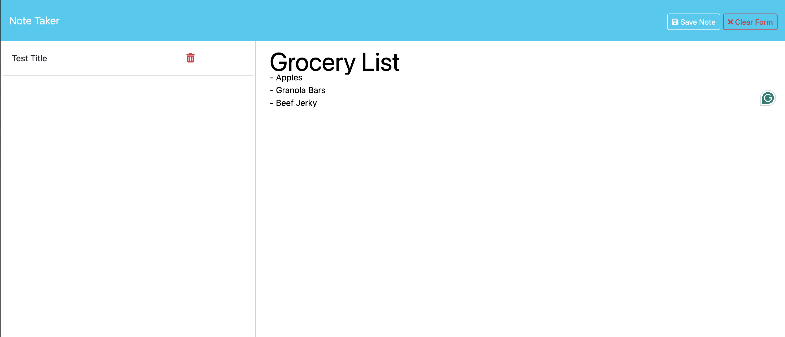

# Note Taker
Having a plan and remembering the tasks for the day is a key part of success as a working professional.<br /><br /> This app is a simple note taker that when used can assist in being more productive and providing our memory some support.
## Table of Contents
- [Installation](#installation)
- [Usage](#usage)
- [License](#license)
- [Contributing](#contributing)
- [Tests](#tests)
- [Questions](#questions)
- [Credits](#credits)
## Installation
To install this repo, simply copy the repo and use git clone in your command line along with the copied repo url with your preferred method.

```bash
git clone git@github.com:andrewhamerly/note-taker.git
```

Please `npm install` to download the dependencies before using with the command `node server.js` to start the local server and use the app in your browser.
## Usage
Useful for keeping track of daily tasks, a grocery list, or other minor notes.



Link to deployed application:
[Andrew Hamerly Note Taker App](https://note-taker-bxn1.onrender.com)
## License
<br />
[License Guide](https://opensource.org/licenses/MIT)<br />
This project is licensed under the MIT License - see the [LICENSE](LICENSE) file for details.
## Contributing
Please enter a new issue in the GitHub repo. Thanks!
## Tests
This app does not have any tests.
## Questions
[GitHub Profile](https://github.com/andrewhamerly)<br />
If you have additional questions, please email me at ah@andrewhamerly.com.
## Credits
The front end was provided with starter code.
